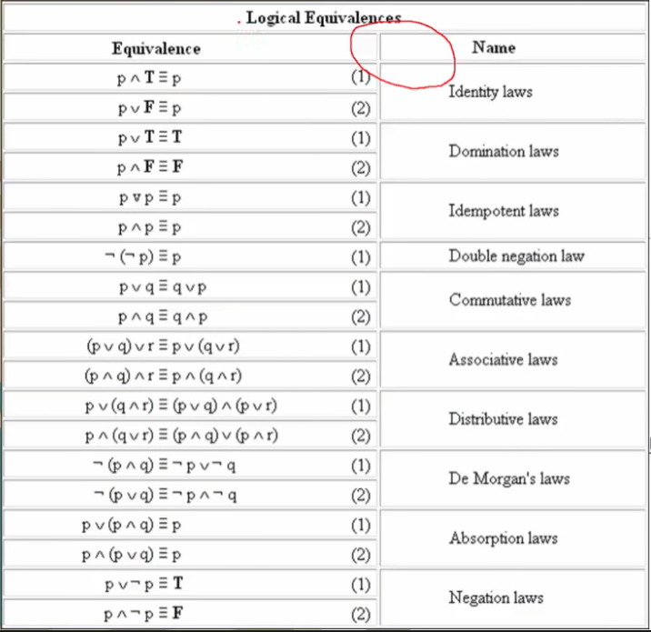

# 이산수학

이산수학 1: https://www.youtube.com/playlist?list=PLRx0vPvlEmdDgOIBt9MKQl-uMVrxtac4n

이산수학 2: https://www.youtube.com/playlist?list=PLW8wOTYOluvFr4favjXEVXMghqQNYOOqI

참고블로그: https://brunch.co.kr/@toughrogrammer/8

## 이산수학 개요

### 💡 이산수학(Discrete Mathmatics): 불연속적인 수학

> 컴퓨터 내부적으로 0과 1만을 다루는데 그런 불연속적인 흐름을 배우기 위해 중요함.
>
> 자료구조나 알고리즘 등 컴퓨팅사고력의 베이스가 됨.

## 명제와 연산자

### 명제: 진실 혹은 거짓

- 참 거짓으로 진리를 구분할 수 있는 문장
- 명제는 0 또는 1만을 가지는 컴퓨터 메모리처럼 항상 참과 거짓 둘 중 하나의 값만을 가진다.
- 여러개의 명제를 조합할 수 있다.

### 연산자: 명제를 연산하기 위한 도구

1. `Not`: 명제의 참 거짓 값을 바꿈. 

2. `And`(논리곱): 두개의 명제를 묶을 때 사용. 두개의 명제 모두 참일 경우만 참 값을 가짐. 그 외는 모두 거짓

3. `Or`(논리합): 두 개의 명제를 묶을 때 사용. 두개의 명제 모두 거짓일 경우만 거짓 값을 가짐. 그 외는 모두 거짓

4. `Exclusive or`(배타적 논리합):  두개의 값 중 1개만 참인 경우만 참. 두개 모두 참 또는 거짓이면 거짓을 반환함.

5. `Implication`(함축):  조건명제. p일때, q이다(`p ➡ q`). 어떠한 조건일 경우에 어떠한 결과가 나온다. 조건과 결과의 흐름을 나타날 때 사용

   **진리표(Truth-Table)**

   |  p   |  q   | p➡q  |
   | :--: | :--: | :--: |
   |  T   |  T   |  T   |
   |  T   |  F   |  F   |
   |  F   |  T   |  T   |
   |  F   |  F   |  T   |

   예시: `1+1=2`일때, `2+2=4`이다. 라는 조건 명제가 있을 때

6. `Biconditional`(쌍방조건명제): `p ↔ q` 두 값이 일치할 때만 참 값을 반환함. 모두 참 또는 모두 거짓일 경우

## 역, 이, 대우

### 진리표

> 각 명제 사이 관계식의 진릿값을 보여주는 표.
>
> 아무리 복잡한 합성 명제라도 진리표로 풀어낼 수 있다.

### 역, 이, 대우

- 조건명제에서 사용
- 하나의 명제를 변형해 표현
- 증명하기 어려운 명제는 대우를 이용해 증명할 수 있음.

#### p➡q

| 역: p와 q 위치 교환 | 이: 각 조건에 not을 붙임 | 대우: 역 + 이 |
| :-----------------: | :----------------------: | :-----------: |
|         q➡p         |          ~p➡~q           |     ~q➡~p     |

- 대우의 경우 본 명제가 참일 경우 대우 명제도 같이 참이됨. 증명하기 어려운 명제에서 자주 사용됨.
- 역, 이 경우 참일 수도 있고, 거짓일 수도 있다.

#### Q. "30이 10보다 크다면 30은 50보다 작다"에 대해서 진릿값을 구하시오. 역 이 대우를 구하고 각각의 진릿값도 구하시오

> ➡
>
> p: 30이 10보다 크다 **참**
>
> q: 30은 50보다 작다 **참**
>
> `p➡q` : 30이 10보다 크다면 30은 50보다 작다. **참**
>
> | 역: 30은 50보다 작으면 30이 10보다 크다. | 이: 30이 10보다 작거나 같다면 30은 50보다 작거나 같다 | 대우: 30이 50보다 작거나 같다면 30은 10보다 작거나 같다 |
> | :--------------------------------------: | :---------------------------------------------------: | :-----------------------------------------------------: |
> |               역은 참이다                |                      이는 참이다                      |              본 명제의 대우 이므로 참이다.              |

이처럼 명제의 역, 이, 대우 를 푸는 문제는 하나씩 적으면서 풀어가면 어려운 문제도 풀린다.

## 동치

### 💡논리적으로 일치한다는 의미. 흔히 같은 의미를 가진 더 쉬운 명제를 발견하는 데 사용한다.

