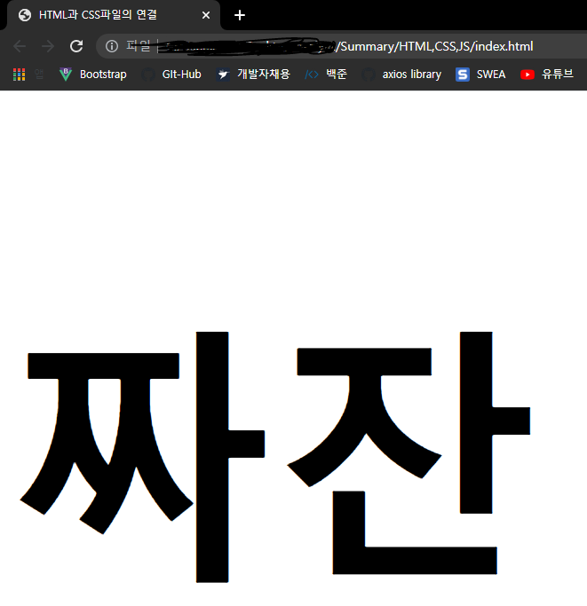
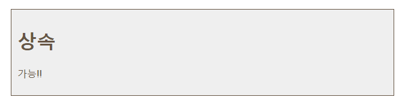

# 🎨CSS

#### 📌CSS 동작방식의 핵심은 HTML의 모든 요소에 박스가 있다고 상상하는 것!
#### 📌CSS 규칙은 선택자와 선언 두 부분으로나뉨

``` css
p{font-family: Arial;}
```

`p`: 선택자

`{font-family: Arial;}`: 선언

#### 📌선언은 구체적으로 속성과 값으로 나뉨

**ex**

``` css
{font-family: Arial;}
```

`font-family`: 속성

`Arial`: 값


## HTML과 연결

#### 1. `link` 사용

`head`에서 `link` 태그로 연결할 수 있다. 하나 이상의 CSS파일 연결 가능.

- 닫기태그가 필요없음
- `head`내부에 존재
- 속성
  - `href`: 파일의 경로를 작성
  - `type`: 문서의 타입을 지정. 값은 `text/css`
  - `rel`: HTML 파일과 연결된 파일간의 관계를 지정. 값은 `stylesheet`

**ex.1**

``` html
<!DOCTYPE html>
<html lang="en">
<head>
  <title>HTML과 CSS파일의 연결</title>
  <link href="CSS/index.css" rel="stylesheet" type="text/css">
  <meta charset="UTF-8">
  <meta http-equiv="X-UA-Compatible" content="IE=edge">
  <meta name="viewport" content="width=device-width, initial-scale=1.0">
</head>
<body>
  <h1>짜잔</h1>
</body>
</html>
```

#### 2. head 내부에 작성

- `style`태그를 사용하여 태그 안에 CSS문법을 적용.
  - 태그안에 `type="text/css"`속성을 지정해 CSS스타일임을 암시해줄 수 있음(생략가능)
- 모든 페이지에 균일한 스타일 사용

**ex.2**

``` html
<!DOCTYPE html>
<html lang="en">
<head>
...
  <style>
    h1{font-size: 300px;}
  </style>
</head>
<body>
  <h1>짜잔</h1>
</body>
</html>
```

#### 3. 태그 내부에 작성

``` html
...
<h1 style="font-size:300px;">짜잔</h1>
...
```





## CSS 선택자

#### 💡선택자는 이름이 명확해야하며 타입별로 지정할 수 있다.

|      선택자      |                       의미                        |                            사용법                            |
| :--------------: | :-----------------------------------------------: | :----------------------------------------------------------: |
|   범용 선택자    |               문서의 모든 요소 선택               |                           `*` {  }                           |
|   타입 선택자    |                해당 태그 모두 선택                |                    `h1`, `h2`, `h3` {  }                     |
|  클래스 선택자   |                해당 클래스만 선택                 |               `.`note{   }<br /> `p`.note{   }               |
|    id 선택자     |                  해당 id만 선택                   |  #introduction{  }<br /> `id` 속성값이 introduction인 태그   |
|   자식 선택자    |    해당 태그의 바로 다음에 있는 요소(자식요소)    | `li` > `a`{  }<br /> `li`태그 태그 바로 아래에 있는 `a` 태그 |
|   자손 선택자    |     자식요소 뿐 아니라 특정 태그의 자손 요소      | `p` `a`{  }<br /> `p` 태그 안에 있는 `a`태그 . 두 태그 사이에 다른 값이 있어도 상관 없음 |
| 인접 형제 선택자 |                바로 옆에있는 태그                 |  `h1`+`p`{  }<br /> `h1` 태그 바로 다음에 오는 `p`태그 선택  |
| 일반 형제 선택자 | 같은 레벨에 있는 요소를 의미. 바로 옆에 없어도 됨 | `h1 ~ p` {   }<br /> `h1`태그와 같은 레벨에 있는 모든 `p`태그에 적용 |

### 선택자 적용 방식

1. 같은 태그가 두번 호출 되었다면 나중에 호출된 CSS 스타일이 적용된다.

2. 구체적으로 작성된 규칙이 적용된다

   > 예를들어 다른 속성 없는 `p` 태그와 id가 적힌 `<p id='app'>` 태그가 있을때,
   >
   > ``` css
   > p {font-size: 70%;}
   > p#app{font-size: 100%;}
   > ```
   >
   >  가 적용됐다면, 
   >
   > 일반 `p`태그에는 사이즈가 70%로 적용되고 id가 적용된 `p`태그는 100%가 적용된다.

3. `!important` 속성

   > 이 속성이 적힌 태그는 다른 규칙들을 배제하고 가장 우선순위로 적용된다.
   >
   > 값 다음에 `!important`를 적으면 됨.


### 상속

> `body` 에 대해서도 CSS 스타일을 적용할 수 있다. 주로 텍스트 요소가 상속됨(`font-family`, `color`). `background-color` 또는 `border` 같은 범위가 있는 요소들이 상속된다면 혼란이 올 수 있기 때문. 
>
> 범위가 있는 속성들을 선언하고 후에 CSS스타일 적용 요소에 `해당 속성: inherit`을 입력하면 상속 가능
>
> ``` HTML
> ...
> <body>
>   <div class="page">
>     <h1>상속</h1>
>     <p>가능!!</p>
>   </div>
> </body>
> <style>
>   body{
>     font-family: Arial, Verdana, sans-serif;
>     color: #665544;
>     padding: 10px
>   }
>   .page{
>     border: 1px solid #665544;
>     background-color: #efefef;
>     padding: inherit;
>   }
> </style>
> ```
>
>  
>
> 
