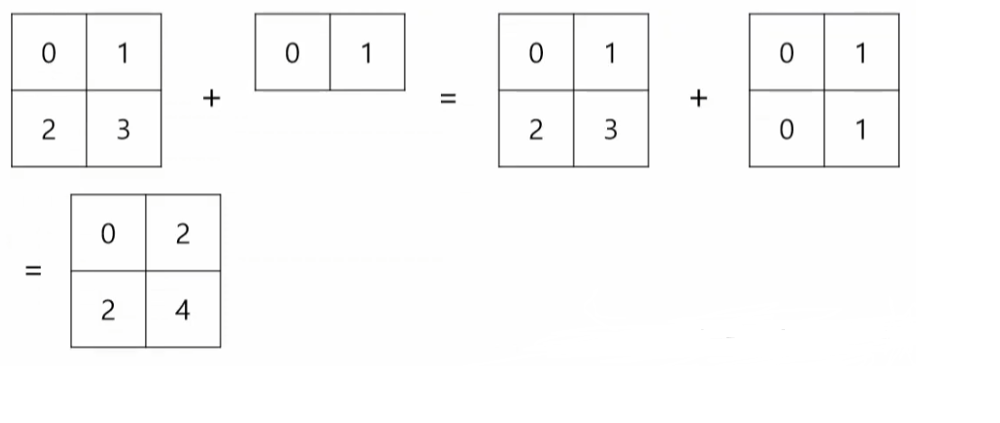
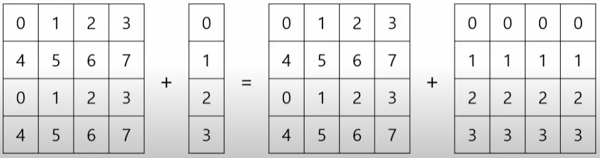

# 과제 및 학습내용


## Numpy

- 다차원 배열을 효과적으로 처리할 수 있도록 도와주는 파이썬 라이브러리
- 현실 세계의 다양한 데이터는 배열 형태로 표현할 수 있음
- Python의 기본 List에 비해 빠르고 강력한 기능을 제공


### Numpy의 차원

- 1차원 축(행): axis 0 => Vector
- 2차원 축(열): axis 1 => Matrix
- 3차원 축(채널): axis 2 => Tensor(3차원 이상)


> Numpy 설치 (Pycharm)
>
> settings > Project Interpreter > `+`버튼 > numpy 검색 > numpy Install package


```python
import numpy as np

list_data = [1,2,3]
array = np.array(list_data)

print(array.size)
print(array.dtype)
print(array[2])
'''
3
int32
3
'''
```

**numpy는 이처럼 array함수로 list를 array 로 만들 수 있고, array는 다양한 메서드를 갖는다**


```python
# 0부터 3까지 Vector 만들기
array1 = np.arange(4) # [0 1 2 3]
print(array1)
# [0 1 2 3]

# 0으로 초기화된 Matrix 생성
array2 = np.zeros((4,4), dtype=float)
print(array2)
'''
[[0. 0. 0. 0.]
 [0. 0. 0. 0.]
 [0. 0. 0. 0.]
 [0. 0. 0. 0.]]
'''

# 1으로 초기화된 Matrix 생성
array3 = np.ones((3,3), dtype=str)
print(array3)
'''
[['1' '1' '1']
 ['1' '1' '1']
 ['1' '1' '1']]
'''

# 0부터 9까지 정수로 초기화된 Matrix 생성(값 중복 가능)
array4 = np.randint(0, 10, (3, 3))
print(array4)
'''
[[3 7 6]
 [6 9 0]
 [3 4 8]]
'''
```

- np.arange(n): 0부터 n-1까지의 Vector를 만듦
- np.zeros((행수, 열수), dtype=지정할 타입): Matrix 내 모든 값들을 0으로 초기화된 Matrix를 만듦
  - dtype: Matrix 안 값의 Type을 지정해 주는 이름 파라미터
- np.ones((행수, 열수), dtype=지정할 타입): zeros와 비슷한 매커니즘으로 Matrix내 모든 값들이 1인 Matrix를 만듦
- np.random.randint(최솟값, 최댓값, (행수, 열수)): 범위내의 랜덤한 숫자로 값을 채운 Matrix 생성


#### random.normal: 통계적으로 특정한 분포를 따르는 데이터

```python
# 평균이 0이고, 표준편차가 1인 표준 정규를 띄는 배열: 표준정규분포
array5 = np.random.normal(0, 1, (3, 3))
print(array5)
'''
[[ 0.5188608   0.17691429  0.93149779]
 [-0.11101656  0.21861622  0.43117057]
 [-0.99765748 -1.04471234  0.12598646]]
'''
```

- np.random.normal(평균, 표준편차, (행수, 열수)): 정규분포를 만듦


### concatenate: 배열 합치기

``` python
# 배열 합치기
array1 = np.array([1,2,3])
array2 = np.array([4,5,6])

array3 = np.concatenate([array1, array2])
print(array3.shape)
print(array3)
'''
(6,)
[1 2 3 4 5 6]
'''
```


#### reshape: 배열 합치기

``` python
array1 = np.array([1, 2, 3, 4])
array2 = array1.reshape((2, 2))

print(array2)
'''
[[1 2]
 [3 4]]
'''
```


#### 세로축으로 합치기

```python
array1 = np.array(4).reshape(1,4)
array2 = np.array(2, 10).reshape(2,4)

print(array1)
print(array2)
'''
[[0 1 2 3]]
[[2 3 4 5]
 [6 7 8 9]]
'''

array3 = np.concatenate([array1, array2], axis=0)
'''
[[0 1 2 3]
 [2 3 4 5]
 [4 5 6 7]]
'''
# array2의 바로 윗 줄에 합쳐짐
```


#### 배열 나누기

```python
array1 = np.arange(8).reshape(2, 4)
# 나눌 array, 인덱스 2를 기준으로 나눔, axis=1:설정한 인덱스는 열을 나타냄 axis=0은 행을 나타냄
left, right = np.split(array1, [2], axis=1)

print(array)
print(left)
print(right)
```


## Numpy 연산

### 상수(스칼라)연산

``` python
# 1. 더하기
array = np.random.randint(1, 10, size=4).reshape(2, 2)
print(array)
'''
[[3 3]
 [7 4]]
'''

# 2. 곱하기
result = array*10
print(result)
'''
[[30 30]
 [70 40]]
'''
```


### 서로 다른 형태의 Numpy 연산

> Numpy는 서로 다른 형태의 배열을 연산할 때 행 우선으로 수행됩니다.
>
> 
>
> 행이 늘어나서 연산을 수행함 > **브로드캐스팅**
>
> ```  python
> array1 = np.arange(4).reshape(2, 2)		# 2x2
> array2 = np.arnage(2)	# 1x2
> 
> result = array1 + array2
> print(array1)
> '''
> [[0 1]
>  [2 3]]
> '''
> print(array2)	# [0 1]
> 
> print(result)
> '''
> [[0 2]
>  [2 4]]
> '''
> ```
>
> **브로드캐스팅**: 형태가 다른 배열을 연산할 수 있도록 배열의 형태를 동적으로 변환
>
> 
>
> 
>
> ``` python
> arr1 = np.arange(0, 8).reshape(2, 4)
> arr2 = np.arange(0, 8).reshape(2, 4)
> arr3 = np.concatenate([arr1, arr2], axis=0)
> print(arr3)
> '''
> [[0 1 2 3]
>  [4 5 6 7]
>  [0 1 2 3]
>  [4 5 6 7]]
> '''
> 
> arr4 = np.arange(0, 4).reshape(4, 1)    # 4 x 1
> print(arr4)
> '''
> [[0]
>  [1]
>  [2]
>  [3]]
> '''
> 
> print(arr3 + arr4)
> '''
> [[ 0  1  2  3]
>  [ 5  6  7  8]
>  [ 2  3  4  5]
>  [ 7  8  9 10]]
> '''
> # arr4가 4x1 에서 오른쪽으로 복사된 4x4형태로 브로드캐스팅 된 후 합쳐졌음
> ```


#### 마스킹연산

> **마스킹**: 각 원소에 대하여 체크 True, False
>
> ``` python
> arr1 = np.arange(16).reshape(4, 4)
> print(arr1)
> '''
> [[ 0  1  2  3]
>  [ 4  5  6  7]
>  [ 8  9 10 11]
>  [12 13 14 15]]
> '''
> arr2 = arr1 < 10
> print(arr2)
> '''
> 10보다 작은 값들에만 False가 들어가고 나머지는 True
> 즉 조건을 만족하는 작업에만 True를 줄 때 사용
> 
> [[ True  True  True  True]
>  [ True  True  True  True]
>  [ True  True False False]
>  [False False False False]]
> '''
> 
> # 조건을 통과한 값들은100 으로 바꿔줌
> arr1[arr2] = 100
> print(arr1)
> '''
> [[100 100 100 100]
>  [100 100 100 100]
>  [100 100  10  11]
>  [ 12  13  14  15]]
> '''
> # 실제 이미지처리에서 색상이 너무밝거나 어두울 때 특정한 색으로 바꿀 때 사용함
> # 일일이 원소를 방문해서 처리할 때보다 빠르게 처리할 수 있어서 매우 편리함
> ```


#### 집계함수

> ``` python
> arr1 = np.arange(16).reshape(4, 4)
> 
> print("최댓값: ", np.max(arr1))
> print("최솟값: ", np.min(arr1))
> print("평균: ", np.mean(arr1))
> print("합계: ", np.sum(arr1))
> '''
> 최댓값:  15
> 최솟값:  0
> 평균:  7.5
> 합계:  120
> '''
> 
> # 특정한 축(열 또는 행)에 대해서만 값을 찾을 수도 있음
> print(arr1)
> print('합계: ', np.sum(arr1, axis=0))	# 열끼리 합
> print('합계: ', np.sum(arr1, axis=1))	# 행끼리 합
> ```


## Numpy 활용

> **저장 및 불러오기**
>
> ```python
> # 단일 객체 저장 및 불러오기
> arr1 = np.arange(0, 10)
> 
> # 저장하는 함수 save / 단일객체 확장자 npy
> np.save('saved.npy', arr1)
> 
> result = np.load('saved.npy')
> print(result)
> '''
> [0 1 2 3 4 5 6 7 8 9]
> '''
> 
> # 복수 객체 저장 및 불러오기
> 
> arr1 = np.arange(0, 10)
> arr2 = np.arange(10, 20)
> 
> # 복수 객체 저장함수 savez / 복수객체 확장자 npz 
> # 저장할 때 이름을 array1, array2... 로 지정하고 불러올 때 사용함
> np.savez('saved.npz', array1=arr1, array2=arr2)
> 
> data = np.load('saved.npz')
> result1 = data['array1']
> result2 = data['array2']
> 
> print(result1)
> print(result2)
> '''
> [0 1 2 3 4 5 6 7 8 9]
> [10 11 12 13 14 15 16 17 18 19]
> '''
> ```
>
> 
>
> **정렬**
>
> ``` python
> arr1 = np.array([5, 9, 10, 3, 1])
> 
> # Numpy에서 기본적으로 제공하는 sort메서드. 오름차순으로 정렬
> arr1.sort()
> print(arr1)
> 
> # 인덱싱기법을 활용할 수 있음
> print(arr1[::-1])
> '''
> [ 1  3  5  9 10]
> [10  9  5  3  1]
> '''
> 
> # 각 열을 기준으로 정렬
> arr1 = np.array([[5, 9, 10, 3, 1], [8, 3, 4, 2, 5]])
> print(arr1)
> '''
> [[ 5  9 10  3  1]
>  [ 8  3  4  2  5]]
> '''
> arr1.sort(axis=0)
> print(arr1)
> # 열로 비교하여 큰 수가 아래 행으로 이동함
> '''
> [[ 5  3  4  2  1]
>  [ 8  9 10  3  5]]
> '''
> ```
>
> 
>
> **균일한 간격으로 데이터 생성**
>
> 임의의 데이터 셋을 만들고자할 때 자주 사용
>
> ``` python
> # 시작값, 끝값, 몇개의 데이터가 있는지
> arr1 = np.linspace(0, 10, 5)
> print(arr1)
> ```
>
> 
>
> **난수의 재연**
>
> 다양한 머신러닝 기법을 실습할 때 사용
>
> ``` python
> # 실행마다 결과 다름
> arr1 = np.random.randint(0, 10, (2, 3))
> 
> # 난수 고정
> np.random.seed(7)
> # 실행마다 결과 같음
> arr2 = np.random.randint(0, 10, (2, 3))
> ```
>
> 
>
> **배열 객체 복사**
>
> ``` python
> arr1 = np.arange(0, 10)
> 
> # 기존 파이썬 리스트처럼 기존 객체를 그대로 참조함
> arr2 = arr1
> arr2[0] = 99
> print(arr1)
> # [99  1  2  3  4  5  6  7  8  9]
> ==================================
> arr1 = np.arange(0, 10)
> 
> # copy 메서드로 객체를 그대로 복사(주소참조x)
> arr2 = arr1.copy()
> arr2[0] = 99
> print(arr1)
> print(arr2)
> '''
> [0 1 2 3 4 5 6 7 8 9]
> [99  1  2  3  4  5  6  7  8  9]
> '''
> ```
>
> 
>
> **중복원소 제거**
>
> ``` python
> arr1 = np.array([1, 1, 1, 1, 2, 2, 2, 2, 2, 3, 3, 4])
> print(np.unique(arr1))
> # [1 2 3 4]
> ```
