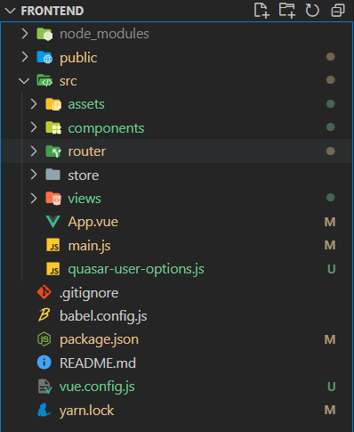

# Quasar


## Vue.js 문법을 기반으로 하는 Framework

> `Quasar CLI`도 있고 기존 `Vue CLI` 에서 플러그인으로 사용할 수 있음

### 순서

1. `Vue` 버전을 먼저 확인한다. `Vue/CLI`가 2.xx 버전이면 삭제하고 다시 설치한다

   > ``` bash
   > $ vue --version		# 버전 확인
   > 
   > # vue_cli가 2.xx 버전일 때만 진행
   > $ npm uninstall -g vue/cli
   > # or
   > $ yarn global remove vue-cli
   > 
   > $ npm install -g @vue/cli
   > ```

2. vue에 quasar 추가

   > ``` bash
   > $ vue add quasar
   > ```
   >
   > `quasar`를 추가하면 `quasar-user-options.js` 라는 파일이 생선된다.
   >
   > 
   >
   > `package.json` 파일의 dependencies에  quasar 추가
   >
   > ``` json
   > ...  
   > "dependencies": {
   >  "@quasar/extras": "^1.0.0",
   >  "core-js": "^3.6.5",
   >  "quasar": "^2.0.0",
   >  "vue": "^3.0.0",
   >  "vue-router": "^4.0.0-0",
   >  "vuex": "^4.0.0-0"
   > },
   > ...
   > ```

3. `Quasar` 컴포넌트 사용하기

   > https://quasar.dev/vue-components

