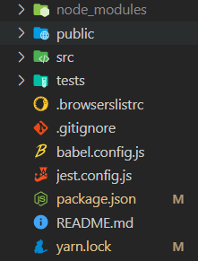
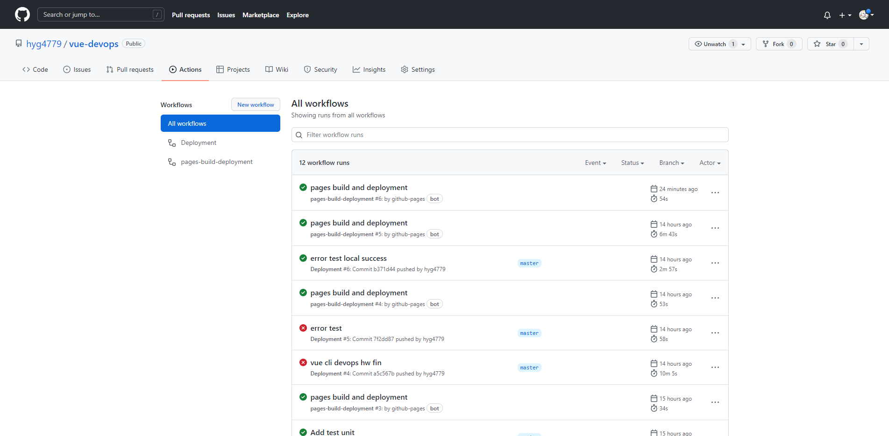
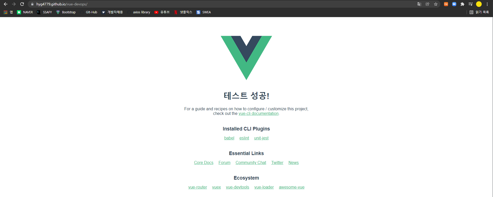

# TIL

# Vue CLI 프로젝트 기반 DevOps 실습

> 💡 yarn과 github을 통한 배포를 진행하는 프로젝트.

### 사전 준비 사항

## Vue CLI


> - 정의: Command Line Interface의 약자. 윈도우에서는 Command창, 맥에서는 터미널 창에서 타이핑으로 명령어를 입력해 원하는 작업을 실행시키는 도구를 뜻하는 단어. 내부적으로 Webpack을 활용.
> - 응용: 빠르게 Vue pjt생성, vue.config.js를 설정하여 웹팩구성에 대해 오버라이딩하여 추가설정 가능


## Devops 란?

> 개발 / 빌드 / 테스팅 / 배포 / 모니터링 / 운영 이 유기적으로 이루어지는 사항.
>
> 개발과 운영이 하나의 파이프라인으로 이어지는 처리방식


## yarn

- Facebook에서 개발한 JS package manager
- npm 보다 가벼움


1. yarn 설치

   ``` bash
   npm install --global yarn
   ```

2. Vue Manual Select features

   

   - ESLint + Prettier: 에러가 있는 코드에 표시를 해주는 옵션 + 사용자가 작성한 코드를 무시하고, 정해진 규칙에 따라 자동으로 코드 스타일을 정리해 주는 코드 포멧터

   - Unit: build과정중 테스트과정을 실행시키는 옵션

   - Jest: unit테스트를 실행시키는 라이브러리

### 배포과정

1. Github 에 Repo 생성하기

   - <Github_ID>.github.io 로 하면 모듈 추가 부분 생략가능

   

2. Github Pages로 배포하기 위한 라이브러리 추가 

   ``` bash
   yarn add gh-pages -D
   ```

   

3. package.json에 homepage, script>predeploy, deploy, clean 부분 추가

   ``` 
    ...
     "homepage": "https://[github아이디].github.io/[repo이름]",
     "script":{
     	...
     	"predeploy": "vue-cli-service build",
     	"deploy": "gh-pages -d dist",
     	"clean": "gh-pages-clean"
     }
   ```

4. 프로젝트 최상단 vue.config.js 생성 (page주소를 적어주는 파일)

   ``` js
   module.exports = {
       publicPath: "/vue-devops/",
       outputDir: "dist"
   };
   
   > ✅ vue-devops 대신 github_id.github.io를 적었다면 이 설정을 필요 없음!

5. yarn deploy 명령어로 정적파일을 repo에 올림(branch: gh-pages)


여기 까지 하면 배포는 성공!


### 배포 자동화

1. Github Actions workflow 생성

> Actions에 `Simple workflow`  생성
>
> > - 파일명 deploy.yml
> > - `name` Deployment로 수정
> > - Commit
>
> Commit 과 동시에 workflow가 동작함


💡 **workflow** 사용 장점

> 우리가 커밋함과 동시에 workflow가 자동으로 빌드를 실행함
>
> build과정중 error가 발생하면 발생 지점을 자동으로 알려주기 까지함.
>
> 자동배포까지 실행


2. workflow 파일 수정 (deploy.yml)

   - blank.yml => depoly.yml
   - name을 `Deployment` 로 수정

   > 폴더구조 최상단 `github`/`workflow`/`deploy.yml`

   ``` yml
   jobs:
   
     deploy:
       runs-on: ubuntu-latest
   
       steps:
       - name: Checkout source code
         uses: actions/checkout@master
   
       - name: Set up Node.js
         uses: actions/setup-node@master
         with:
           node-version: 14.x
   
       - name: Install dependencies
         run: yarn install
         
   	# 배포 전 build 과정을 미리 테스트 하는 부분
   	# 배포에 실패하고 서비스에 반영되면 안되기 때문에 설치하는 안전장치 같은 개념
       - name: Test unit
         run: yarn test:unit
         
       - name: Build page
         run: yarn build
         env:
           NODE_ENV: production
   
       - name: Deploy to gh-pages
         uses: peaceiris/actions-gh-pages@v3
         with:
           github_token: ${{ secrets.GITHUB_TOKEN }}
           publish_dir: ./dist
   ```

   

   **workflow 상태창**

   


​	**배포성공화면**

​	
