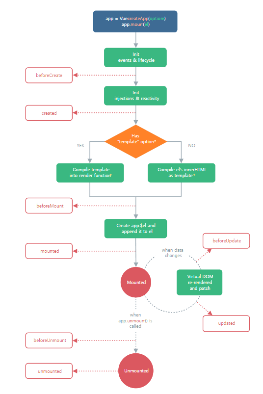

#### 실전형 README에 작성할 문구

-------

#### Vue 컴포넌트 이해

> `Vue` 는 `App.vue`가 가장 최상단에서 하위에 속하는 모든 컴포넌트를 보여줌. `App.vue`와 다른 컴포넌트들에 속하는 모든 컴포넌트 들은 `component` 폴더에서 관리되고 `router`를 사용해서 바뀌는 페이지들은 `views` 폴더에서 관리된다.
>
> 💡 모든 `vue`파일들은 `PascalCase`로 이름을 짓는것이 관행
>
> `router` 로 바뀌는 페이지들은 `router`폴더의 `index.js`에 등록을 해야만 사용 가능함

----------------------------

# Vue


- ### 💡 컴포넌트 기반의 SPA를 구축할 수 있게 해주는 프레임워크

  > - `Component`: 웹을 구성하는 다양한 UI 요소. 재사용 가능하도록 구조화 한 것(`navbar`, `logo` ...)
  > - **SPA (Single Page Application)**
  >   - 단일 페이지 어플리케이션으로 최초의 페이지 로딩 후 필요한 부분만 동적으로 `DOM` 형성
  >   - 빠른 페이지 변환 (초기 페이지 트레픽이 큼)
  >   - 페이지 변환시 적은 트래픽 양
  > - 동작원리의 일부가 CSR(Client Side Rendering)의 구조를 따름
  >   - 서버에서 화면구성(SSR)을 하는 것이 아닌 클라이언트 측에서 구성 (서버와 트래픽 감소 / UX 향상)
  >   - 최초 요청시 HTML, CSS, JS 등 데이터를제외한 각종 리소스를 응답받고 이후에는 클라이언트 측에서 필요한 데이터만 요청해 JS로 DOM을 렌더링 하는 방식
  >   - 처음에 뼈대만 받고 브라우저 동적으로 DOM을 형성(SPA)
  
- ### MVVM Pattern

  - 앱 로직을 UI로부터 분리하기 위해 설계된 디자인 패턴

  - Model / View / ViewModel 구성

    - Model

      > Javascript Object. 즉, Vue Instance에서 data. 이 데이터가 바뀌면 View(DOM)dlm qksdmd

    - View

      > DOM. data에 따라 바뀌는 대상

    - View Model

      > 모든 View Instance.
      >
      > View와 Model 사이에서 Data와 DOM관련된 모든 일을 처리. DOM을 구성하는 과정

**CDN**

```html
<script src="https://cdn.jsdeliver.net/npm/vue/dist/vue.js"></script>
```

**npm**

```bash
# latest stable
$ npm install vue@next
```

**인스턴스 생성 ex**

``` html
<div id="app">
    <span v-bind:title="msg">Hello World!</span>
    <p v-if"seen">
         can u see me?
    </p>
    <ol>
        <li v-for="todo in todos">
        	{{todo.text}}
        </li>
    </ol>
    <p>
        {{Greeting}}
    </p>
    <button v-on:click="reverseGreeting">
        인삿말 뒤집기
    </button>
    <p>
        {{bindingData}}
    </p>
    <input v-model="bindingData">
</div>
```

```js
const app = new Vue({
    el:'#app',
    data(){	
        return{
            msg: '지금 시간은' + new Date() + '입니다.', 
            seen: true,
            todos:[
                text: 'Hi',
                text: 'Hello',
                text:  'Hey',
            ],
            Greeting: 'Hellow',
            bindingData: '안녕 Vue!'
        }
    },
    methods:{
        reverseGreeting(){
            this.Greeting = this.Greeting.split('').reverse().join('')
        }
    }
})
```


## Vue DOM (template 와 render)

> `template`: data, methods, computed ... 등 연결되어 있는 HTML 마크업 문서
>
> `render`:  `template`와 연결되어있는 data를 불러오는 function
>
> DOM 이 형성된다 ➡ `template`가 `render`된다


## Vue LifeCycle Hook



1. `beforeCreate`(코드옵션 추가 직전)
2. `created`(computed, watch, method등을 코드옵션 완료)
3. `beforeMount`(component를 Dom에 추가하기 직전)
4. `mounted`(component가 Dom에 추가되고 난 후)
5. `beforeUpdate`(자체 렌더링 일어나기 직전)
6. updated`(자체 렌더링 끝나고 난 후)`
7. `beforeDestroy`(다른 컴포넌트로 이동하기 직전)
8. `destroyed`(완전히 컴포넌트로 이동된 직후)

> 총 8가지 사이클을 가짐. methods, computed 처럼 lifecycle 훅 때마다 DOM 동작을 설정할 수 있음.
>
> Life Cycle Hook은 Component 별 데이터의 생성과정이 많아지고 비동기적으로 움직이는 데이터를 관리할 때 매우 중요한 개념!
>
> **ex**
>
> ``` js
> Vue.createApp({
>   data() {
>     return { count: 1 }
>   },
>   created() {
>     console.log('count is: ' + this.count) // => "count is: 1"
>   }
> })
> ```


## Vue  Data

> `data`는 함수형태로 작성한다. (컴포넌트 인스턴스에 데이터 객체를 반환하는 함수)
>
> `data`에서 브라우저의 API객체나 포로토타입 속성과 같이 자체적으로 상태동작을 가진 객체보다 단지, 컴포넌트 데이터를 나타내는 일반객체가 있는것이 좋음(상태동작 객체는 `Vuex`활용)


## 템플릿 문법

1. 문자열 이중괄호 구문

   ``` html
   <span>메세지: {{msg}}</span>
   ```

2. 속성접근 Directive

   ``` html
   <div v-bind:id="dynaminId"></div>
   ```

   > `v-` 방식으로 나타냄 `Directive 문법 따로 정리함`

3. Javascript 표현식 사용 가능

   > `{{ number + 1}}` / `{{ message.split('').reverse().join('') }}`


## 스크립트 문법

#### 📌모든 Vue Instance는 여러 옵션을 사용하여 새 인스턴스를 구성함 (Vue Instance == Vue Component)

**ex**

``` html
<div id="app">
    <button @click="myFuncA">a</button>
    <button @click="myFuncB">b</button>
</div>
<script src="https://cdn.jsdeliver.net/npm/vue/dist/vue.js"></script>
<script>
	const app = new Vue({
        el: '#app',
        data(){
            return({
                a: 1,
            })
        },
        methods:{
            myFuncA(){
                console.log(this) // Vue Instance
            },
            myFuncB: () => {
                console.log(this) // window
            }
        }
    })
</script>
```

> 1. `el`: `template`에 요소와 연결(마운트)하는 DOM 엘리먼트
> 2. `data`: 함수형으로 작성됨. `return`으로 `data`를 `object` 형태로 반환. Vue Instance 내에서 this키워드로 접근 가능
> 3. `methods`: Vue instance에 추가하는 메서드
> 4. `this`: JS 문법을 잘 보고 오자!


## Directive (디렉티브)

> #### v 접두사가 있는 특수 속성
>
> - 전달인자 (Arguments)
>
>   - `:` 을 통해서 전달인자를 받을 수 있음
>
>   - 전달받는 인자는 큰따옴표로 작성
>
>     ``` html
>     <a v-bind:href="url">...</a>
>     ```
>
>     `v-bind:href` 를 `:href` 로 줄여서 사용 가능
>
> - 수식어 (Modifier)
>
>   - `.` 으로 표시되는 접미사로 directive를 바인딩 할 때 나타냄


### 1. v-html

> ``` html
> <p>{{rawHtml}}</p>
> <p><span v-html>{{rawHtml}}></span></p>
> ```
>
> `p태그` 안의 `span태그` 값은 `rawHtml`값으로 대체됨. 웹사이트의 임의의 HTML을 동적으로 렌더링 한다면 **XSS 취약점**으로 이어질 수 있으니 `v-html`은 사용을 자제하는 것이 좋다
>
> **XSS 취약점 (Cross Site Scripting)**
>
> 사용자가 보는 웹페이지를 클라이언트 측에서 스크립트를 삽입 할 수 있다. `XSS`은 심각한 경우 공격자가 사이트의 데이터를 제어할 수 있어 심각한 보안 위험요소이다.


### 2. v-text

> ```vue
> <template>
> 	<div id="app">
>         <p v-text="msg"></p>
>     </div>
> </template>
> <script>
>     const app = new Vue({
>         el: "#app",
>         data(){
> 			return{
>                 msg: "Hello"
>             }
>         }
>     })
> </script>
> ```
>
> 엘리먼트의 textContent를 template에 나타냄


### 3. v-show

> 


