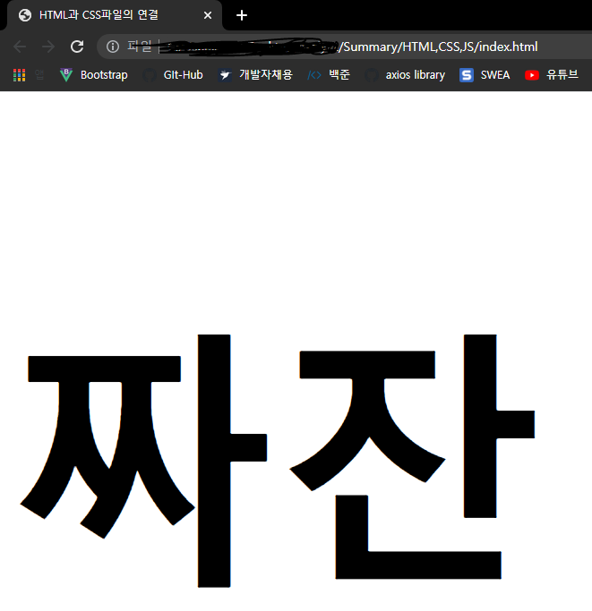

# 🎨CSS

#### 📌CSS 동작방식의 핵심은 HTML의 모든 요소에 박스가 있다고 상상하는 것!
#### 📌CSS 규칙은 선택자와 선언 두 부분으로나뉨

``` css
p{font-family: Arial;}
```

`p`: 선택자

`{font-family: Arial;}`: 선언

#### 📌선언은 구체적으로 속성과 값으로 나뉨

**ex**

``` css
{font-family: Arial;}
```

`font-family`: 속성

`Arial`: 값


## HTML과 연결

#### 1. `link` 사용

`head`에서 `link` 태그로 연결할 수 있다. 하나 이상의 CSS파일 연결 가능.

- 닫기태그가 필요없음
- `head`내부에 존재
- 속성
  - `href`: 파일의 경로를 작성
  - `type`: 문서의 타입을 지정. 값은 `text/css`
  - `rel`: HTML 파일과 연결된 파일간의 관계를 지정. 값은 `stylesheet`

**ex.1**

``` html
<!DOCTYPE html>
<html lang="en">
<head>
  <title>HTML과 CSS파일의 연결</title>
  <link href="CSS/index.css" rel="stylesheet" type="text/css">
  <meta charset="UTF-8">
  <meta http-equiv="X-UA-Compatible" content="IE=edge">
  <meta name="viewport" content="width=device-width, initial-scale=1.0">
</head>
<body>
  <h1>짜잔</h1>
</body>
</html>
```

#### 2. head 내부에 작성

- `style`태그를 사용하여 태그 안에 CSS문법을 적용.
  - 태그안에 `type="text/css"`속성을 지정해 CSS스타일임을 암시해줄 수 있음(생략가능)
- 모든 페이지에 균일한 스타일 사용

**ex.2**

``` html
<!DOCTYPE html>
<html lang="en">
<head>
...
  <style>
    h1{font-size: 300px;}
  </style>
</head>
<body>
  <h1>짜잔</h1>
</body>
</html>
```

#### 3. 태그 내부에 작성

``` html
...
<h1 style="font-size:300px;">짜잔</h1>
...
```





## CSS 선택자

#### 💡선택자는 이름이 명확해야하며 타입별로 지정할 수 있다.

|      선택자      |                       의미                        |                            사용법                            |
| :--------------: | :-----------------------------------------------: | :----------------------------------------------------------: |
|   범용 선택자    |               문서의 모든 요소 선택               |                           `*` {  }                           |
|   타입 선택자    |                해당 태그 모두 선택                |                    `h1`, `h2`, `h3` {  }                     |
|  클래스 선택자   |                해당 클래스만 선택                 |               `.`note{   }<br /> `p`.note{   }               |
|    id 선택자     |                  해당 id만 선택                   |  #introduction{  }<br /> `id` 속성값이 introduction인 태그   |
|   자식 선택자    |    해당 태그의 바로 다음에 있는 요소(자식요소)    | `li` > `a`{  }<br /> `li`태그 태그 바로 아래에 있는 `a` 태그 |
|   자손 선택자    |     자식요소 뿐 아니라 특정 태그의 자손 요소      | `p` `a`{  }<br /> `p` 태그 안에 있는 `a`태그 . 두 태그 사이에 다른 값이 있어도 상관 없음 |
| 인접 형제 선택자 |                바로 옆에있는 태그                 |  `h1`+`p`{  }<br /> `h1` 태그 바로 다음에 오는 `p`태그 선택  |
| 일반 형제 선택자 | 같은 레벨에 있는 요소를 의미. 바로 옆에 없어도 됨 | `h1 ~ p` {   }<br /> `h1`태그와 같은 레벨에 있는 모든 `p`태그에 적용 |

### 선택자 적용 방식

1. 같은 태그가 두번 호출 되었다면 나중에 호출된 CSS 스타일이 적용된다.

2. 구체적으로 작성된 규칙이 적용된다

   > 예를들어 다른 속성 없는 `p` 태그와 id가 적힌 `<p id='app'>` 태그가 있을때,
   >
   > ``` css
   > p {font-size: 70%;}
   > p#app{font-size: 100%;}
   > ```
   >
   >  가 적용됐다면, 
   >
   > 일반 `p`태그에는 사이즈가 70%로 적용되고 id가 적용된 `p`태그는 100%가 적용된다.

3. `!important` 속성

   > 이 속성이 적힌 태그는 다른 규칙들을 배제하고 가장 우선순위로 적용된다.
   >
   > 값 다음에 `!important`를 적으면 됨.


### 상속

> `body` 에 대해서도 CSS 스타일을 적용할 수 있다. 주로 텍스트 요소가 상속됨(`font-family`, `color`). `background-color` 또는 `border` 같은 범위가 있는 요소들이 상속된다면 혼란이 올 수 있기 때문. 
>
> 범위가 있는 속성들을 선언하고 후에 CSS스타일 적용 요소에 `해당 속성: inherit`을 입력하면 상속 가능
>
> ``` HTML
> ...
> <body>
>   <div class="page">
>     <h1>상속</h1>
>     <p>가능!!</p>
>   </div>
> </body>
> <style>
>   body{
>     font-family: Arial, Verdana, sans-serif;
>     color: #665544;
>     padding: 10px
>   }
>   .page{
>     border: 1px solid #665544;
>     background-color: #efefef;
>     padding: inherit;
>   }
> </style>
> ```
>
>  
>
> 


## 색상

### 1. color: 요소 내부에 있는 텍스트 색상을 지정하는 프로퍼티

#### 색상지정 방법 3가지

- RGB값: rgb(n,m,k) 방식으로 n,m,k 값을 지정해서 넣어줌

- 헥사코드: 빨강 초록 파랑색의  양을 헥사코드로 표현

- 색상명: 147 가지 존재

  ``` css
  /* 예시 RGB, 헥사코드, 색상명 */
  h3 { color: rgb(00,100,90);}
  h3 { color: #ee3e80;}
  h3 { color: blue;}
  ```


### 2. background-color: 요소 내부의 바탕색 지정

>  색상지정방법은 `color`와 동일하다

### 3. 투명도 opacity 와 rgba

1. opacity: 요소의 투명도를 설정할 수 있는 속성으로 값은 퍼센트로 따지며, 0부터 1까지 지정할 수 있음 (ex. 0.5 === 50%)

2. rgba: 색상지정 rgb 방법의 마지막 값을 하나 추가한 방식으로, opacity 처럼 퍼센트로 따짐

   ``` css
   /*예시*/
   p {
       background-color: rgb(0, 0, 0);
       opacuty: 0.5;
   }
   div{
       backgound-color: rgba(0, 0, 0, 0.5);
   }
   ```


### 4. HSL색상

#### 📌 색상지정 4번 째 방법으로 색조, 채도, 밝기(, 투명도) 선택가능

1. `hsl`: `rgb`와 비슷한 방식으로 사용함. **h: 색조(hue), s: 채도(saturation), l: 밝기(lightness)**

2. `hsla`: `rgba`와 같은 맥락

   ``` css
   /*예시*/
   p {
       background-color: rgb(0, 0, 0);
       background-color: hsl(0, 0, 78%);
   }
   div{
       background-color: rgba(0, 0, 0, 0.5);
       background-color: hsla(0, 100%, 100%, 0.5);
   }
   ```

   

## 텍스트

1.  `font-family`: 사용할 서체 이름

2. `font-size`: 픽셀, 퍼센트, em으로 지정 (1em은 하나의 m문자의 너비 기준)

   픽셀 퍼센트 em 비교

|    픽셀    | 퍼센트 |   em   |
| :--------: | :----: | :----: |
|  h1: 24px  |  200%  | 1.5em  |
|  h2: 18px  |  150%  | 1.3em  |
|  h3: 14px  |  117%  | 1.17em |
| body: 12px |  75%   |  100%  |

3. `@font-face`: 다양한 폰트 선택할 수 있는 프로퍼티

   > 브라우저 사용자의 PC에 폰트가 설치돼있지 않아도, 이 속성을 사용해 내려받아 사용가능하다.
   >
   > 중요한건 이 방식을 허용하는지 폰트에 대한 라이선스를 확인해야한다.
   >
   > **폰트포멧?**

   ``` css
   @font-face{
       font-family: 'HongGilDong';	/*다운받아온 서체 이름 지정*/
       src: url('~~~');	/*다운받아온 출처*/    
   }
   
   h1, h2 {
       font-family: 'HongGilDong'
   }
   ```

4. `font-weight`: 굵은 글꼴. normal, bold

5. `font-style`: 기울임꼴.

   > - normal
   > - italic: 이탤릭체
   > -  olique:단순 기울임꼴

6. `text-transform`: 대문자 소문자 변경

   > - uppercase: 모두 대문자
   > - lowercase: 모두 소문자
   > - capitalize: 단어 첫 글자 대문자

7. `text-decoration`: 밑줄, 취소선

   > - none: 적용된 효과 해제
   > - underline: 밑줄 추가
   > - overline: 윗줄 추가
   > - line-through: 가운데에 줄
   > - blink: 텍스트 깜빡임

8. `line-height`: 텍스트 간의 새로간격을 띄워 가독성을 높히는 프로퍼티.  px, %,em으로 조절

9. `word-spacing`, `letter-spacing`: 자간.  px, %,em으로 조절

10. `text-align`: 텍스트 정렬

    > - left
    > - right
    > - center
    > - justify: 단락에서 마지막줄을 제외하고 양쪽으로 정렬

11. `text-vertical`: 세로정렬.테이블에서만! 사용할 수 있는 요소(<th>, <td>). px, %,em으로 조절

    > - baseline
    > - sub
    > - super
    > - top
    > - text-top
    > - middel
    > - bottom
    > - text-bottom

12. `text-indent`: 들여쓰기. px, em으로 조절

13. `text-shadow`: 그림자효과 

    > text-shadow: 1px 1px 0px #000000;
    >
    > ➡ 첫번째 값부터 가로길이, 세로길이, 번짐효과(선택적), 그림자 색상을 뜻함
    >
    > ``` css
    > /*예시*/
    > p .one{
    >     background-color: #eeeeee;
    >     color: #666666;
    >     text-shadow: 1px 1px 0px #000000;
    > }
    > ```

14. `:forst-letter`, `:first-line`: 요소 내 첫번째 문자 또는 줄. 기술적으로 **유사요소** 라고 부름

    > ``` css
    > /*예시*/
    > p.intro:first-letter{
    >     font-size:200%;
    > }
    > 
    > p.intro:first-line{
    >     font-weight:blod;
    > }
    > ```

15. `:link`, `:visited`: 링크에 대한 스타일. 방문 전 링크와 방문한 링크

    ``` css
    /*예시*/
    a:link{
        color: deeppink;
        text-decoration: none;
    }
    
    a:visited{
        color: black;
        text-dacoration: underline;
    }
    ```

16. `:hover`, `:actice`, `:focus`':사용자에대한 반응

    > `hover`: 마우스가 요소위에 올라갔을 때
    >
    > `active`: 요소를 실행할 때
    >
    > `focus`: 요소에 포커스 잡혔을 때
    >
    > ``` css
    > /*예시*/
    > input{
    >     padding: 6px, 12px, 6px, 12px;
    >     border: 1px solid #665544;
    >     color: #ffffff;
    > }
    > 
    > input.submit:hover{
    >     background-color: #665544;
    > }
    > input.submit:active{
    >     background-color: chocolate;
    > }
    > input.text:focus{
    >     color: #665544;
    > }
    > ```
    >
    > 
