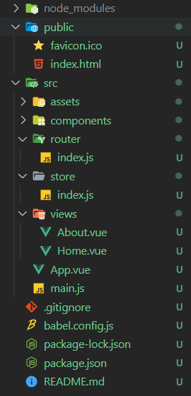

# Vue CLI를 통합 개발환경 구축하기

- node.js 사이트에서 LTS버전 다운받기 링크: https://nodejs.org/ko/

- ``` bash
  npm install --g @vue/cli
  ```

- ``` bash
  $ vue create <project_name>
  ```

- 개발환경에 대한 다양한 옵션들이 존재함

  ``` bash
  Vue CLI v4.5.15
  ? Please pick a preset: Manually select features
  ? Check the features needed for your project: Choose Vue version, Babel, Router, Vuex
  ? Choose a version of Vue.js that you want to start the project with 3.x
  ? Use history mode for router? (Requires proper server setup for index fallback in production) Yes
  ? Where do you prefer placing config for Babel, ESLint, etc.? In package.json
  ? Save this as a preset for future projects? No
  ```

- ``` bash
  $ npm run serve
  ```

  local host:8080 에서 서버가 돌아감

- 폴더구조

  

- `package.json` 에 프로젝트에 필요한 모듈들이 정의되어 있음. 


