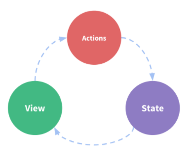
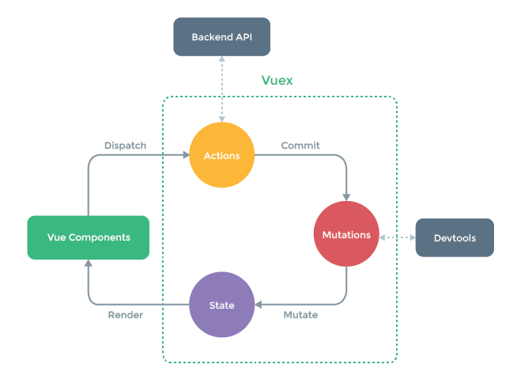
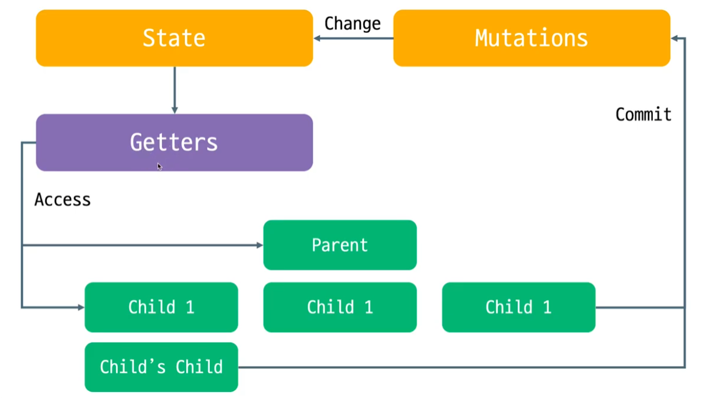
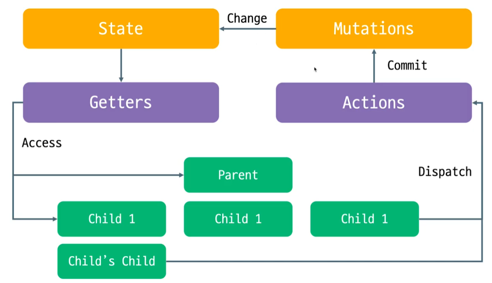

# Vuex

## Vue.js 애플리케이션에 대한 상태 관리 패턴 & 라이브러리

애플리케이션의 모든 컴포넌트에 대한 **중앙 집중식 저장소** 역할을 하여 예측가능한 방식으로 상태를 변경할 수 있음




> **State**: 앱을 작동하는 원본 소스
>
> **Actions**:뷰에서 사용자 입력에 대한 반응적으로 상태를 바꾸는 방법
>
> **View**: 상태의 선언적 매핑

### Vuex를 사용하는 이유

> 지나치게 중첩된 컴포넌트의 경우 `props` 와 `emit`이 계속 쌓이게 되어 장황해져 가독성을 저하시킴
>
> 따라서 Vuex의 중앙집중저장소를 활용하여 지나친 중첩을 피하고 보다 간편하게 데이터를 관리할 수 있다




### 1. 설치

1. CDN을 활용하기

   ``` html
   <script src="/path/to/vue.js"></script>
   <script src="/path/to/vuex.js"></script>
   ```

2. NPM

   ``` bash
   $ npm install vuex --save
   ```

3. `Vue CLI`를 통한`Vue app` 생성시 `select features` 에서 선택


### 2. 저장소

#### 3번 옵션을 선택했다는 가정 하에 설명

최종적으로 `Vuex` 설치가 끝나면 `App.vue`와 동일한 레벨에 `store` 폴더가 생성됨

#### stors폴더의 index.js 파일 내부

``` js
import { createStore } from 'vuex'

export default createStore({
  state: {
  },
  getters: {	// gettes는 생성되지 않을 수 있기에 따로 추가해놓는다
  },
  mutations: {
  },
  actions: {
  },
  modules: {	// 거의 사용하지 않는 속성
  }
})
```

1. `state`: 실질적인 데이터를 명시해 놓는 장소
2. `mutation`: `state`에 선언된 데이터에 직접적으로 접근하는 장소
3. `actions`: 컴포넌트에서 `store`에 처음으로 접근할 때 도달하는 장소. 주로 백엔드 서버와의 통신이 이루어지고, `mutation`으로 조작할 데이터를 보냄
4. `getters`: `state`에 있는 데이터를 기반으로 계산된 데이터 속성을 저장하는 장소. 컴포넌트 내부의 `computed`속성과 비슷


#### 예시 컨셉

``` js
// store/ index.js
import { createStore } from 'vuex'

export default createStore({
  state: {
      users: [{name; "Mike", age: 30, isAdult: true},
              {name; "Tom", age: 23, isAdult: true},
              {name; "James", age: 46, isAdult: true},
              {name; "Hannah", age: 16, isAdult: false}]
  }
  getters: {
      userCount: function (state){
      	return state.users.length
	  },
      adultCount: function (state){
          let result = 0
          state.users.forEach((user)=>{
              if(user.isAdult) result++
          })
          return result
      },
      adultPercentage: function (state, getters){
          return Math.round(getters.adultCount / getters.userCount * 100)
      }
  }
  },
  mutations: {
      addUsers: function (state, payload) => {
          state.users.push(payload)
      }
  },
  actions: {
  }
})
```

> #### `getters` 사용방법
>
> 1. `state`의 데이터를 접근하려면 인자에 `state`를 선언해주고 작성해야함
> 2. `getters` 데이터를 접근하려면 `state`를 먼저 선언해주고 `getters`를 작성해야 접근 가능
> 3. 무조건 `return` 값이 있어야 함
>
> #### `getters`속성을 컴포넌트에서 사용하는 방법
>
> 1. `import { mapState } from 'vuex'`로 먼저 `Getters`호출
>
> 2. `computed` 속성에서 호출한 속성 객체 전개 연산자로 선언
>
>    1. 배열 선로 선언
>
>       ``` html
>       <script>
>       import { mapGetters } from 'vuex'
>       // import { mapMutations } from 'vuex'
>           
>       export default {
>         // ...
>         methods:{
>           // ...mapMutations(['addUsers']),
>           signUp(){
>               let userObj = {
>                   // userId: ...
>               }
>               // this.addUsers(userObj)
>               this.$store.commit('addUsers', userObj)
>           }
>         },
>         computed: {
>           // getter를 객체 전개 연산자(Object Spread Operator)로 계산하여 추가합니다.
>           ...mapGetters([
>             'userCount',
>             'adultCount',
>             // ...
>           ])
>         }
>       }
>       
>       </script>
>       ```
>
>    2. `Object`로 선언 (`Getters`와 다른이름으로 사용할 때 사용)
>
>       ``` html
>       ...mapGetters({
>         // this.doneCount를 store.getters.doneTodosCount에 매핑하십시오.
>         adultRatio: 'adultPercentage'
>       })
>       ```
>
> 
>
> #### `mutations` 사용 방법
>
> > **컴포넌트 내에서도 데이터에 직접적인 선언이 가능한데 왜 `mutations`를 사용해야 할까?**
> >
> > 
> >
> > 만약 `child 1` 과 `child 2` 에서 각각 같은 함수를 사용해서 `State`에 접근해 데이터를 바꾼다면, 불필요한 코드를 두번 반복하게 된다. 따라서 `mutation`에서 `State`데이터를 관리하는 메서드를 만들고 `commit`을 통해 `mutations`을 호출하여 사용하는 것이 직관적으로 더 보기 좋다
> >
> > `payload`: 보통 컴포넌트에서 받아온 정보를 뜻함
> >
> > 1. `Getters`와 같은 방식으로 `import`를 사용하는 방식 **(비추천)**
> >
> > 2. `this.$store.commit(mutation 함수명, 전달할 데이터)` 를 선언하는 방식 **(비추천)**
> >
> > 3. #### `actions`를 사용하는 방식 **(추천)**
> >
> >    > ``` js
> >    > this.$store.dispatch('actions 함수명', 전달할 데이터)
> >    > ```
>
> 
>
> #### `actions` 사용 방법
>
> > `mutations`을 바로 접근해서 사용하는것을 비추천하는 이유
> >
> > `mutation`을 사용해서 작동하면 비동기적이 아닌 동기적인 로직으로 진행됨. 따라서 비동기적으로 움직이기 위한 `actions` 같은 비동기 로직을 사용함
> >
> > #### 예시 컨셉 actions 추가
> >
> > ``` js
> > // store/ index.js
> > import { createStore } from 'vuex'
> > 
> > export default createStore({
> > ...
> >   mutations: {
> >       addUsers: function (state, payload) => {
> >           state.users.push(payload)
> >       }
> >   },
> >   actions: {
> >       addUsers: function (context, payload){	// context로 commit을 접근할 수 있음
> >           context.commit('addUsers', payload)
> >       }
> >   }
> > })
> > ```
> >
> > ``` html
> > <script>
> > import { mapGetters } from 'vuex'
> >     
> > export default {
> >   // ...
> >   methods:{
> >     signUp(){
> >         let userObj = {
> >         }
> >         this.$store.dispatch('addUsers', userObj)
> >     }
> >   },
> > ...
> > 
> > </script>
> > ```
> >
> > `actions`로 보내는 방식
> >
> > ``` js
> >  this.$store.dispatch(actions 함수명, 전달할 데이터)
> > ```
> >
> > 나중에 `actions`에 속한 한 가지 함수에서 여러 `mutation`을 호출할 경우 `context.commit`을 자주 사용하게 됨.
> >
> > ➡ 객체로 commit을 불러와서 해결
> >
> > ``` js
> > ...
> > actions: {
> >       addUsers: function ({commit}, payload){
> >           commit('addUsers', payload)
> >       }
> >     ...
> > ```
> >
> > 최종모습은 처음에 app내에서 `dispatch`로 `actions`내부 함수를 호출하여 데이터를 보내고 `actions`에서 전달받은 데이터를 처리한 후(백엔드와 통신) `mutation`으로 보내 state.로 접근하는 방식


## 최종 Vuex 통신 그래프




``` sh
├── index.html
├── main.js
├── api
│   └── ... # API 요청을 위한 추상화를 포함합니다.
├── components
│   ├── App.vue
│   └── ...
└── store
    ├── index.js          # 모듈을 조합하고 저장소를 내보내는 곳 입니다.
    ├── actions.js        # 루트 액션
    ├── mutations.js      # 루트 변이
    └── modules
        ├── cart.js       # cart 모듈
        └── products.js   # products 모듈
```


