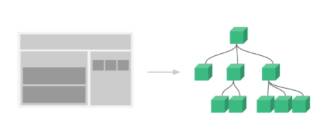
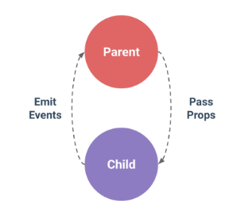

# Vue의 컴포넌트 간 데이터통신

> Vue app은 컴포넌트들로 엮여 최종적으로 app.vue로 모이는 트리로 구성됨
>
> 따라서 컴포넌트들 간 부모 자식 관계가 형성되고 상하 통신이 필요함.
>
> 
>
> 이때 부모 컴포넌트 ➡ 자식 컴포넌트로 보내는 데이터 전달을 **Pass props**,
>
> 자식 컴포넌트 ➡ 부모 컴포넌트로 메세지를 보내는 것이 **emit event**라고 한다.


### 부모-자식 컴포넌트의 구성

``` vue
<template>
  <div>
    <h2>부모 컴포넌트</h2>
    <About />	<!-- 3. 등록된 컴포넌트 불러오기 -->
  </div>
</template>
<script>
import About from '../components/About.vue'	  // 1. 등록할 자식 컴포넌트 import
export default{
    name: 'App',
    component:{		// 자식 컴포넌트를 등록하는 공간
        About,		// 2. 자식 컴포넌트 등록
    },
}
</script>
<style>
</style>
```


**정적 props**

- 부모 컴포넌트의 정보를 명시적으로 선언하여 수신하는 옵션.

- **부모 컴포넌트로 부터 받은 데이터는 자식 컴포넌트에서 직접 참조하여 제어할 수 없음!** 데이터 흐름을 어지럽힘

  ➡ 단방향 바인딩을 형성.

  ```vue
  <!--App.vue 부모 컴포넌트-->
  <template>
    <div>
      <h2>부모 컴포넌트</h2>
      <About static-props="This is static props"/>	<!-- 데이터 내려주기 -->
    </div>
  </template>
  ```

  props 데이터 작성법: kebab-case-name="value"

  ``` vue
  <!--About.vue 자식 컴포넌트-->
  <template>
    <div>
      <h2>자식 컴포넌트</h2>
      <h4>{{ staticProps }}</h4>
      <!-- props 데이터 사용 -->
    </div>
  </template>
  <script>
  export default{
      name: 'About',
      props:{
          staticProps: String,
      // props 데이터 선언
      }
  }
  </script>
  ```

  받은 props 데이터 명명법: cameCase


**동적props**

- 부모 데이터를 사용. props는 부모 데이터가 업데이트 될 떄마다 자식 데이터로 전달됨

    ```vue
    <!--App.vue 부모 컴포넌트-->
    <template>
      <div>
        <h2>부모 컴포넌트</h2>
        <About
          static-props="This is static props"
          :my-props="myProps"
        />	<!-- 데이터 내려주기 -->
      </div>
    </template>
    <script>
    import About from '../components/About.vue'	  // 1. 등록할 자식 컴포넌트 import
    export default{
        name: 'App',
        component:{		// 자식 컴포넌트를 등록하는 공간
            About,		// 2. 자식 컴포넌트 등록
        },
        data(){
            return{
                myProps: "This is parent data"
            }
        }
    }
    </script>
    ```

    ``` vue
    <!--About.vue 자식 컴포넌트-->
    <template>
      <div>
        <h2>자식 컴포넌트</h2>
        <h4>{{ staticProps }}</h4>
        <h4>{{ myProps }}</h4>
        <!-- props 데이터 사용 -->
      </div>
    </template>
    <script>
    export default{
        name: 'About',
        props:{
            staticProps: Strung,
            myProps: String,
        // props 데이터 선언
        }
    }
    </script>
    ```

  > 만약에 넘기는 데이터라 1 일때,
  >
  > 정적 데이터로 넘기면 숫자를 의도하였더라고 문자형으로 들어감.
  >
  > 따라서 숫자데이터를 넘기려면 무조건 동적 props를 사용해야함


**Emit event**

- 사용법: `$emit(eventName)`

- 자식 컴포넌트에서 이벤트를 트리거 하여 리스너의 콜백 함수로 전달 

  (전달할 데이터가 있다면, eventName 뒤에 작성)

- 부모 컴포넌트는 자식 컴포넌트가 보낸 이벤트를 청취(`v-on`을 이용한 사용자 지정 이벤트)

  ``` vue
  <!--About.vue 자식 컴포넌트-->
  <template>
    <div>
      <h2>자식 컴포넌트</h2>
      <h4>{{ myProps }}</h4>
      <!-- props 데이터 사용 -->
        
      <input
        type="text"
        @keyup.enter="childCompoEvent"
        v-model="childCompoData"
      >
    </div>
  </template>
  <script>
  export default{
      name: 'About',
      props:{
          myProps: String,
      // props 데이터 선언
      },
      data(){
          return{
              childCompoData: null,
          }
      },
      methods:{
          childCompoEvent(){
              this.$emit('child-compo-event', this.childCompoData)
          }
      }
  }
  </script>
  ```

  ``` vue
  <!--App.vue 부모 컴포넌트-->
  <template>
    <div>
      <h2>부모 컴포넌트</h2>
      <About
        static-props="This is static props"
        :my-props="myProps"
        @child-compo-event="parentChangeData"
      />
        <!-- child-compo-event를 청취하여 parentChangeData함수 실행 -->
    </div>
  </template>
  <script>
  import About from '../components/About.vue'	  // 1. 등록할 자식 컴포넌트 import
  export default{
      name: 'App',
      component:{		// 자식 컴포넌트를 등록하는 공간
          About,		// 2. 자식 컴포넌트 등록
      },
      data(){
          return{
              myProps: "This is parent data"
          }
      },
      methods:{
          parentChangeData(childData){
              console.log(childData)
              this.myProps = "change!"
          }
      }
  }
  </script>
  ```

  > emit함수에 작성된 함수로 발생하는 부모 컴포넌트에서 청취하는 이벤트 이름을 kebab-case로 작성하는이유
  >
  > 컴포넌트 및 props와 다르게 이벤트는 자동 대소문자 변환을 제공하지 않음
  >
  > 하지만 HTML내에서 대소문자 구분을 위해 DOM 템플릿의 v-on 이벤트 리스너는 매번 소문자로 변환되기에
  >
  > 예시로 camelCase로 작성한 문구는 camelcase로 변환되기에 kebab-case로 작성하는 것을 권장함
