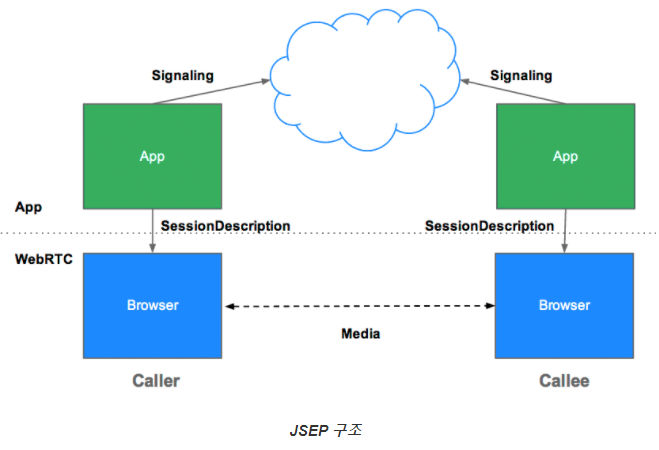

# Websocket

> 브라우저와 서버는 `HTTP`를 통해 소통함
>
> 이는 인터넷 데이터 교환에서 필수 / 업로드 다운로드 이미지 문서 등등 인터넷에서 오가는 모든 요소들이 http를 통해 이동함
>
> > **http 작동원리**
> >
> > 유튜브로 들어오면 브라우저는 `http request`로 유튜브 서버로 보내고 유튜브 서버는 요청에 맞는 홈페이지를 구성하는 모든 자료를 `http response`에 담아서 브라우저로 보냄.
>
> 브라우저와 서버의 통신은 1번의 request와 response로 끝남. 즉 서버는 브라우저에게 요청이 없는한 데이터를 보낼 수 없음.
>
> 따라서 우리가 채팅을 하려면 메세지가 왔을 때마다 새로고침을 해서 확인해야함.
>
> 이를 극복하려고 만든 것이 **Web Socket**이다

#### 웹소켓은 Request와 Response를 통한 요청이 아닌 Open Close로 연결되어 있다.

- 브라우저가 웹소켓을 이용해 서버와 연결을 하면 해당 통신은 원하는 순간까지 열려있다
- 서버는 업데이트를 원한느 때에 바로 보낼 수 있음. 주로 채팅방, 주식거래 앱, 게임같은 리얼타임 경험을 위해 만들어짐.
- 즉 단체 채팅방에서 소통은 구성원들과 연결이 되어 있는것이 아닌 같은 웹소켓 서버에 입장한 것.

#### 메모리 파워가 중요함

- 유저가 많으면 많을수록 더 많은 메모리가 필요하고 서버에 돈이 많이 들어감
- 서버의 속도도 중요함. 리얼타임으로 빠르게 이동해야함
- 서버에 수많은 커넥션이 오면 그에따른 딜레이가 발생함 ➡ UX 저하
- 서버가 내려가면 누구도 대화를 할 수 없음. ➡ 브라우저를 서버에 연결하는 것이 아닌 브라우저 끼리 연결하는 시도가 생김 ➡ **Web RTC**

# Web RTC (Web Real Time Communication)

## 💡브라우저끼리 연결을 도와줌.  Peer to Peer Communication

### 단순 텍스트뿐 아닌 영상, 오디오, 채팅 모두 리얼타임으로 할 수 있음. 모든 자료를 서버를 통하지 않아 이전 보다 빠름.

#### Web RTC 문제점

- 확장성의 제약이 있음

  ➡ 예를 들어 채팅방에 1000명의 사람이 있다면 999명의 데이터를 다운받고 999명에게 나의 데이터를 업로드 시켜줘야함.

# WebRTC 앱에 필요한 백엔드 서비스 구축

- 시그널링 이라 불리는, 클라이언트들의 통신을 조정하기 위한 메타 데이터의 교환서버
- 네트워크 주소 변환기(NAT) 및 방화벽 대응을 위한 서버

> 시그널링 서버 구축방법과 STUN, TURN 서버들을 이용하여 실제 연결과정을 구현
>
> 또한 WebRTC 앱들이 어떻게 다단위의 호출을 제어할 수 있는지와 VoIP나 PSTN과 같은 서비스(전화)들과의 상호작용 설명

## 시그널링 이란?

> 통신 조정의 프로세스. WebRTC 앱의 call을 초기화하기 위해 클라이언트는 다음과 같은 정보교환을 필요로함
>
> - 통신을 열고 닫는데 사용되는 세션 컨트롤 메세지들
> - 에러메세지들
> - 코덱이나 코덱설정, 대역폭, 미디어 타입같은 미디어 메타 데이터
> - 보안 연결을 수립하기 위해 사용되는 키 데이터
> - 밖에서 보이는 것처럼 호스트의 IP주소와 포트와 같은 네트워크 데이터
>
> 이 시그널링 프로세스는 클라이언트에서 메세지를 앞 뒤로 전달하기 위한 방법을 필요로 함. 그 메커니즘은 WebRTC API에 의해 구현되지 않음. 직접 구현해야함

## JSEP

> 중복 회피와 호환성을 최대화하기 위해 기술, 시그널링 방법 그리고 프로토콜의 설정은 WebRTC 표준 규격에 정의되어 있지 않음. 이 접근 방식은 JSEP(Javascript Session Establishment Protocol)의해 설명됨
>
> WebRTC call 설정은 완전하게 규격화되어 미디어 통로(Media Plane)을 제어하지만 어플리케이션에 가능하면 최대한 시그널링 증가를 방지해야 합니다*
>
> JSEP의 구조는 브라우저가 상태를 저장하지 않음. (즉, Signaling State Machine인 함수에 전달하는 경우) 이 경우도 문제가 있을 수 있습니다. 시그널링 데이터가 페이지가 리로딩되면서 매번 사라지는 경우가 그 예입니다. 대신 시그널링 상태는 서버에 저장될 수 있습니다.

## RTC Peer Connection + 시그널링: 제안, 응답 그리고 후보

> RTCPeerConnection은 WebRTC 어플리케이션이 Peer 간의 연결을 생성하고 오디오와 비디오의 통신 API
>
> 프로세스를 초기화하기 위한 RTCPeerConnection 2가지 요구사항
>
> - 해상도나 가용한 코덱 정보 등의 로컬 미디어 상태: 제안/응답 메커니즘에서 사용되는 메타데이터
> - 후보들로 알려진 어플리케이션 호스트의 잠재적인 네트워크 주소들
>
> 
>
> **생성과정**
>
> 1. 앨리스가 RTCPeerConnection 객체를 생성합니다.
> 2. 앨리스가 *createOffer()* 메소드를 사용하여 제안(SDP Session Description)을 생성합니다.
> 3. 앨리스가 제안과 함께 *setLocalDescription()*를 호출합니다.
> 4. 앨리스는 제안을 문자열화하고 시그널링 메커니즘을 이용하여 이브에게 보냅니다.
> 5. 이브는 앨리스의 제안을 가지고 *setRemoteDescription()*를 호출하였으므로 그녀의 RTCPeerConnection가 앨리스의 설정을 알게됩니다.
> 6. 이브는 em>createAnswer()를 호출하고 이에 대해 로컬 세션 정보(Local Session Description), 즉 이브의 **응답**을 인자로 전달하는 성공 콜백 함수를 호출합니다.
> 7. 이브는 *setLocalDescription()*의 호출을 통해 그녀의 응답을 로컬 기술(Description)으로 설정합니다.
> 8. 그리고나서 이브는 시그널링 메커니즘을 사용하여 그녀의 문자열화된 응답을 앨리스에게 다시 전송합니다.
> 9. 앨리스는 *setRemoteDescription()*을 사용하여 이브의 응답을 원격 세션 기술(Description)으로 설정합니다.
>
> 
>
> 앨리스와 이브는 또한 네트워크 정보의 교환이 필요합니다. '후보들의 발견' 표시는 네트워크 인터페이스의 탐색 절차와 [ICE framework](http://en.wikipedia.org/wiki/Interactive_Connectivity_Establishment)를 사용한 포팅과 관련이 있습니다.
>
> 1. 앨리스는 *onicecandidate* 핸들러를 가진 RTCPeerConnection 객체를 생성합니다.
> 2. 핸들러는 네트워크가 가용 대기 상태가 되면 호출됩니다.
> 3. 핸들러에서 앨리스는 이브에게 그들의 시그널링 채널을 통해 문자열화된 후보 데이터를 전송합니다.
> 4. 이브가 후보 메세지를 앨리스로부터 수신할 때 원격 Peer 기술(Description)으로의 후보를 추가하는 *addIceCandidate()*를 호출합니다.
